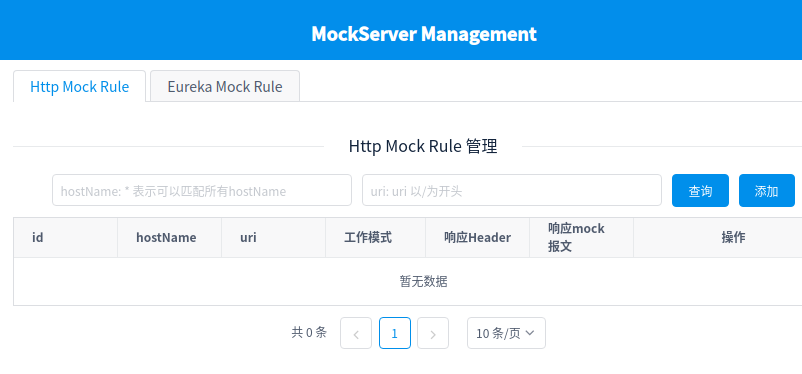

# **Hissummer Mockserver**
***

# 介绍
***
mockserver是模拟http返回报文的一个mock 服务。 可以用于微服务架构下和前端（h5，native app）模拟后端服务报文的开发联调和测试。
hissummer mockserver 还支持mockserver注册到eureka发现中心，可以方便的进行eureka服务实例的mock测试。


#  支持的功能
***
* mock http协议响应报文，响应头
* mock 规则的管理
* 支持eureka 服务的注册，心跳，取消注册功能


# 部署
***
为了更快速的开始，推荐使用docker-compose或者docker进行部署。

## docker-compose 部署

```
$ git clone git@github.com:hissummer-mockserver/buildStandaloneWar.git
$ cd compose
$ sudo docker-compose up -d
```

## docker部署

首先启动mongodb docker服务，然后启动hissummer-mockserver

```
$ sudo docker network create hissummer
$ sudo docker run -d --name hissummer-mongodb --network hissummer  mongo:4.2.5-bionic
$ sudo docker run -d --name hissummer-mockserver --network hissummer -e mongodbHost=hissummer-mongodb -e mongodbPort=27017 -p 8080:8080   nighteblis/hissummer-mockserver
```

## docker + mongodb 部署

请先部署mongodb服务，[如何部署mongodb？](deploy/deploymongodb/)。

```
$ sudo docker run -d --name hissummer-mockserver -e mongodbHost=mongodbHost -e mongodbPort=27017 -p 8080:8080   nighteblis/hissummer-mockserver
```

## war包部署

1. [部署mongodb](deploy/deploymongodb/)
2. [war包构建和部署](deploy/compile/)


# 部署后初始用户名密码
用户名:admin
密码:hissummer.com

***

# 快速开始
***
[快速开始](quickstart/)

# 文档
***
[文档](documents/catalog/)

# 赞助
***
paypal account: [https://www.paypal.me/nighteblis](https://www.paypal.me/nighteblis)
